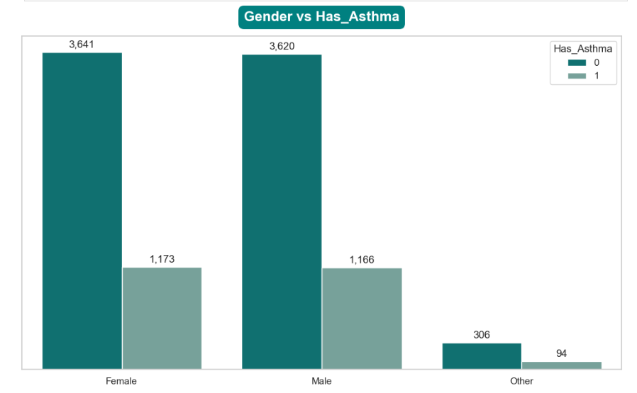
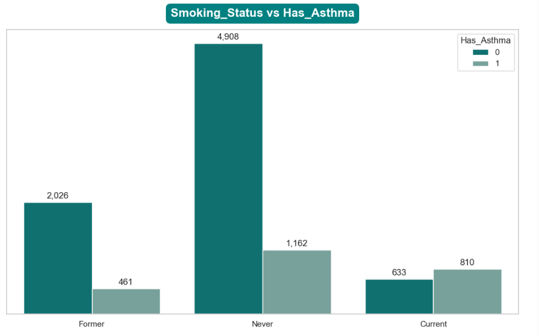
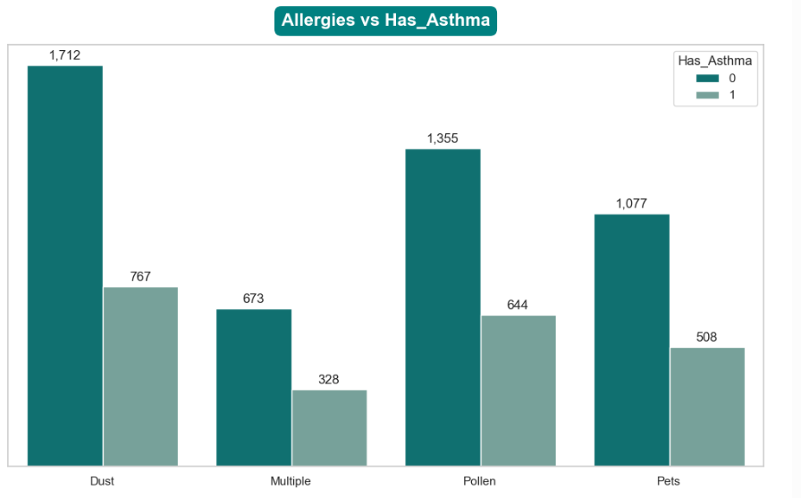
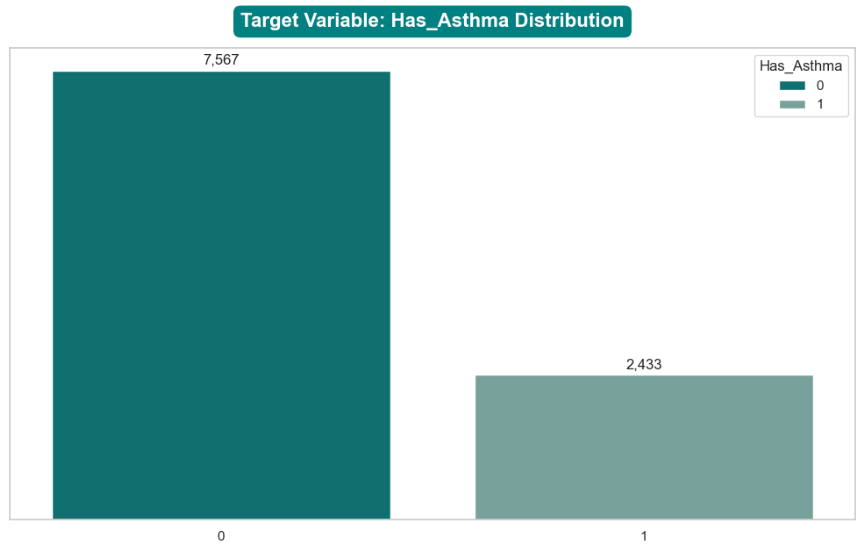

# 🫁 Asthma Prediction — Synthetic Health Dataset

**Author:** Eric Inkoom Ayitey  
**Tools:** Python, Streamlit, Scikit-learn, Pandas, Matplotlib  
**Tags:** Machine Learning · Healthcare Analytics · Feature Engineering · Data Visualization · Deployment

---

## 📌 Overview

This project leverages a synthetic health dataset to build and deploy a predictive model for asthma risk estimation. It demonstrates end-to-end data science workflows that are reproducible, clinically interpretable, and deployable via an interactive web app.

Built with scalability and clarity in mind, the project showcases modular preprocessing pipelines, intelligent input handling, and visual storytelling — ideal for health data prototyping in real-world contexts.

---

## 📊 Dataset Summary

The dataset simulates 15 features spanning:

- **Demographic:** Age, Gender, BMI, Family History  
- **Clinical:** FeNO Level, Peak Expiratory Flow, Medication Adherence, Comorbidities  
- **Behavioral:** Physical Activity Level, Smoking Status  
- **Environmental:** Air Pollution Level, Allergies  
- **Utilization & Outcome:** ER Visits, Asthma Control Level, Has_Asthma (target)

---

## 🔍 Exploratory Insights

- **Asthma prevalence:** Imbalanced classes — majority of records show absence of asthma
- **FeNO levels & ER visits:** Top correlates with asthma incidence
- **Environmental influence:** Air pollution and physical activity levels impact asthma control trends
- **Categorical imputation:** Mode-based fill strategy for robustness and simplicity

---

## 🧠 Modeling Highlights

- ✅ **Pipeline-based training** using `ColumnTransformer` + `RandomForestClassifier`
- 🔁 **Automatic encoding/scaling** of inputs within pipeline for consistent inference
- 🔍 **Feature importance visualization** with teal-themed horizontal bar plots and crisp value labels

---

## 🔢 Evaluation Metrics

| Metric               | Value  |
|----------------------|--------|
| Accuracy             | 0.947  |
| Precision (Class 0)  | 0.96   |
| Recall (Class 0)     | 0.98   |
| F1 Score (Class 0)   | 0.97   |
| Precision (Class 1)  | 0.92   |
| Recall (Class 1)     | 0.86   |
| F1 Score (Class 1)   | 0.89   |
| ROC AUC Score        | 0.9909 |

🧮 **Confusion Matrix**  
      [[1467 37]
      [ 69 427]]

📊 These results show strong overall accuracy with balanced precision and recall across classes. Class 1 (asthma-positive) predictions have high precision, making the model suitable for cautious clinical screening applications.

---

## 🖼️ Visual Snapshot

This section showcases key visuals from the asthma risk prediction project, providing insight into demographic, behavioral, and environmental factors contributing to asthma prevalence.

---

### 🧑‍🤝‍🧑 Gender Distribution & Asthma Prevalence

**Figure 1:** Asthma is distributed almost evenly across male and female patients, with a noticeably lower count among nonbinary individuals. This demographic profile supports inclusive modeling for public health contexts.

---

### 🚬 Smoking Status vs Asthma Risk

**Figure 2:** Current smokers show the highest asthma prevalence relative to other groups. This behavioral insight highlights smoking as a critical risk factor — reinforcing the predictive weight of lifestyle metrics.

---

### 🌾 Allergy Types & Asthma Correlation

**Figure 3:** Environmental allergens like dust and pollen are strongly correlated with asthma occurrence. The plot suggests sensitivity to common triggers significantly elevates risk — a key input for screening models.

---

### 📈 Target Variable Distribution

**Figure 4:** The dataset is imbalanced — with significantly more patients not diagnosed with asthma. This informs model tuning and evaluation, especially in optimizing precision and recall for minority cases.

---

---

## 🌐 Deployment

The app is deployed via **Streamlit Community Cloud** and accepts 14 patient features. It uses a trained ML pipeline to dynamically encode and scale user inputs, returning predicted asthma likelihood in real time.

### 🚀 **Project Access**

👉 **[🔗 Live App – Asthma Risk Prediction](https://asthma-prediction-app-edksy83arxrfajqyzfnmtv.streamlit.app/)**  

### Files Included:

- `app.py`: Streamlit interface  
- `asthma_prediction_pipeline.pkl`: Serialized ML pipeline  
- `asthma_banner.png`: Custom banner image  
- `requirements.txt`: Environment dependencies

---

## 🌍 Real-World Value

- A prototype for asthma screening and education tools  
- Supports community-level analytics in the Global South  
- Provides a reusable foundation for deploying disease models

---

## 📂 Artifacts

| File                          | Description                                  |
|------------------------------|----------------------------------------------|
| `Asthma_Prediction.ipynb`    | Clean analysis notebook with modeling flow   |
| `Asthma_Visuals.html`        | Exported standalone HTML report              |
| `README.md`                  | Project overview and technical guide         |
| `image_1, image_2, image_3`  | Feature importance plot for visual impact    |

---

### 🧪 Future Additions

- SHAP-based interpretability  
- Real-world data validation  
- Model comparison (e.g., XGBoost vs RandomForest)  
- GitHub Actions for CI/CD

---

🚀 Built for scalable health intelligence — from notebook to user-facing app.  
Made with clarity, impact, and reproducibility in mind.
